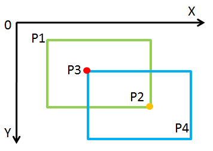

### 判断矩阵相交
首先求出P1与P3点在X方向较大值与Y方向较大值的交点，在下图中就是P3，用红点(记为M点)表示。然后求出P2与P4点在X方向较小值与Y方向较小值的交点，在下图中就是P2，用橙色点(记为N点)表示。如果M点的X坐标和Y坐标值均比N点相应的X坐标和Y坐标值小，亦即M和N可以分别构成一个矩形的左上角点和右上角点，则两矩形相交；其余情况则不相交。



``` C++
class Solution {
public:
    int computeArea(int A, int B, int C, int D, int E, int F, int G, int H) {
        int s1 = (C - A) * (D - B), s2 = (G - E) * (H - F);
        int mix = max(A, E), miy = max(B, F), maxx = min(C, G), maxy = min(D, H);
        if(mix <= maxx && miy <= maxy){
        int s3 = (maxx - mix) * (maxy - miy);
        return s1 + s2 - s3;
        }
        else return s1 + s2;
    }
};
```