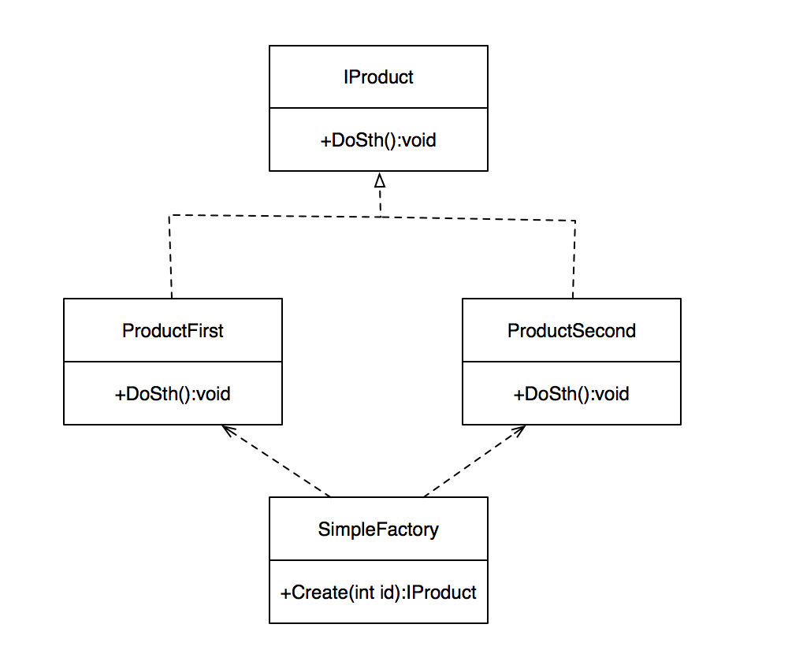
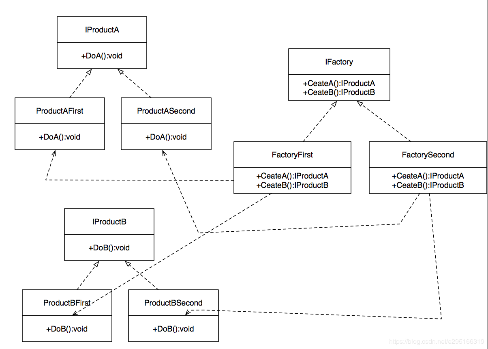

### 六大设计模式
- 开闭原则：一个软件实体如类、模块和函数应该对修改封闭，对扩展开放。
- 单一职责原则：一个类只做一件事，一个类应该只有一个引起它修改的原因。
- 里氏替换原则：子类应该可以完全替换父类。也就是说在使用继承时，只扩展新功能，而不要破坏父类原有的功能。
- 依赖倒置原则：细节应该依赖于抽象，抽象不应依赖于细节。把抽象层放在程序设计的高层，并保持稳定，程序的细节变化由低层的实现层来完成。
- 迪米特法则：又名「最少知道原则」，一个类不应知道自己操作的类的细节，换言之，只和朋友谈话，不和朋友的朋友谈话。
- 接口隔离原则：客户端不应依赖它不需要的接口。如果一个接口在实现时，部分方法由于冗余被客户端空实现，则应该将接口拆分，让实现类只需依赖自己需要的接口方法。


### 工厂模式
##### 简单工厂模式
讲工厂，首先得从简单工厂说起。
简单工厂模式的目的是用来创建不同类型的对象。需要指出的是它并不是GOF的23种模式之一。

**结构:**



**实现:**
``` C#
public interface IProduct {
    void DoSth();
}

public class ProductFirst : IProduct {
    public virtual void DoSth(){
        Debug.Log("ProductFirst DoSth");
    }
}
public class ProductSecond : IProduct {
    public virtual void DoSth(){
        Debug.Log("ProductFirst DoSth");
    }
}

public class SimpleFactory {
    public static IProduct Create(int id){
        switch(id){
            case 1:
                return new ProductFirst();
                break;
            case 2:
                return new ProductSecond();
                break;
            default:
                return null;
                break;
        }
    }
}
```
简单工厂模式的Create()方法里，可以添加各种逻辑，用于创建对应的实例。unity3d中很多时候创建的是游戏中的物件，这时简单工厂模式中创建者的参数可以对应prefab的名字。

**优点**
简单，可以取名叫『2分钟内可以学会的设计模式』
实现逻辑清晰，根据不同的创建参数创建对应实例。
名为简单工厂方法，看起来果然是很简单，对不对？那么，本着”simple is best”的逻辑，是不是我们应该大力推广简单工厂模式呢？
答案是「No」。简单工厂模式有其固有的缺陷，在使用时需要严格限定其范围。

**缺陷**
让我们首先考虑一个问题。此处使用的Create()方法，直接决定我们产生实例的逻辑。
那么，现在问题来了。
假如我们不希望通过判断参数是1还是2，来进行不同实例的生成呢？
显然，一旦我们需要新的逻辑来产生实例的话，我们就不得不对代码进行修改。
当然，从理论上，我们也可以发现简单工厂模式的一些问题。
Open-closed原则，即是对扩展开放，对修改封闭。使用简单工厂模式时，很多时候违背了这一原则。同时，由于产生不同实例的方法在可预见的将来有可能会变得很复杂，是否满足单一职责这一点也值得商榷。
那么，我们有办法解决这个问题吗？嗯，接下来就是抽象程度更高的方法出场了。


##### 工厂方法

工厂方法与简单工厂最大的区别，在于工厂方法将工厂进行了抽象，将实现逻辑延迟到工厂的子类。

**结构**


**实现**
为了让我们例子更贴近生产环境，在这里采用一个更加实际的问题。
场景当中有两个物体，我们希望其中一个向左走，一个向右走。
我们用工厂方法来生成这两个向左向右的控制器，并添加到对应的物体上。当然，事实上这个例子依然很单薄，实际面对这个问题我们肯定不会这样实现就是了。
上代码

 IWalker
``` C#
public interface IWalker {
    void Walk(Transform target);
}
```
LeftWalker
``` C#
public class LeftWalker : MonoBehaviour, IWalker {
    Transform _target;
    public virtual void Walk(Transform target){
        _target = target;
        StartCoroutine(WalkLeft());
    }

    IEnumerator WalkLeft(){
        while(true){
            _target.Translate(Vector3.left * Time.deltaTime);
            Debug.Log("WalkLeft " + _target.localPosition);
            yield return new WaitForFixedUpdate();
        }
    }
}
```

RightWalker
``` C#
public class RightWalker : MonoBehaviour, IWalker  {
    Transform _target;
    public virtual void Walk(Transform target){
        _target = target;
        StartCoroutine(WalkRight());
    }

    IEnumerator WalkRight(){
        while(true){
            _target.Translate(Vector3.right * Time.deltaTime);
            Debug.Log("WalkRight " + _target.localPosition);
            yield return new WaitForFixedUpdate();
        }
    }
}
```

IWalkerFactory
``` C#
public interface IWalkerFactory {
    IWalker Create();
}
```

LeftWalkerFactory
``` C#
public class LeftWalkerFactory : IWalkerFactory {
    public virtual IWalker Create(){
        return new GameObject().AddComponent<LeftWalker>();
    }
}
```

RightWalkerFactory
``` C#
public class RightWalkerFactory : IWalkerFactory{
    public virtual IWalker Create(){
        return new GameObject().AddComponent<RightWalker>();
    }
}
```

**优点**
工厂方法比简单工厂多了一层抽象。
由于抽象工厂层的存在，当我们需要修改一个实现的时候，我们不需要修改工厂的角色，只需要修改实现的子类就可以完成这个工作。
同样，当我们需要增加一个新产品的时候，我们也不需要修改工厂的角色，只需要增加一个新的实现工厂来完成实现就可以了。
显然，这样更易于扩展，并且，整体代码的层级结构更加分明，创建实际产品的职责更加单一。
此外，很显然客户在定义工厂角色的时候不需要知道实现子类。只有当实际需要创建的时候，才动态指定子类。这同样带来了代码的稳定性和最小可知性。

**缺陷**
显然，使用工厂方法的代码量是多于简单工厂的。
同时，每增加一个新的产品，就会增加一个新的工厂类，代码的复杂程度自然也随之上升了。我们会为此创建很多的工厂。

##### 抽象工厂
抽象工厂和工厂方法实际上是很像的，不过抽象工厂增加了另外一个概念，就是产品族。也就是说，一个工厂可以生产一系列的产品，这些产品的定义都在工厂当中。

**结构**



**实现**
ok。这个模式老实说意义不是很大。直接上代码吧，就不加注释了
``` C#
public interface IActorFactory  {
    IFlyer CreateFlyer(GameObject go);
    IWalker CreateWalker(GameObject go);
}
 
public interface IFlyer {
    void Fly(Transform target);
}
 
public class LeftActorFactory : IActorFactory {
    public virtual IFlyer CreateFlyer(GameObject go){
        return go.AddComponent<LeftFlyer>();
    }
 
    public virtual IWalker CreateWalker(GameObject go){
        return go.AddComponent<LeftWalker>();
    }
 
}
 
public class RightActorFactory : IActorFactory{
    public virtual IFlyer CreateFlyer(GameObject go){
        return go.AddComponent<RightFlyer>();
    }
 
    public virtual IWalker CreateWalker(GameObject go){
        return go.AddComponent<RightWalker>();
    }
 
}
```
**优点**
当我们需要增加一个产品族的时候，我们只需要增加一个工厂，实现其中所有产品的实现就行了。 
抽象工厂的设计，使得我们可以很容易的增加一个产品系列。

**缺点**
抽象工厂当中，产品族的定义使得子类必须去实现所有的产品生产。 
因此，抽象工厂并不适合于横向扩展，即需要增加产品的情况。 
一旦需要增加产品，那么我们甚至需要去修改抽象的基类。这是比较违反开闭原则，不太符合面向对象设计的做法。

**总结**
从简单工厂到工厂方法再到抽象工厂。我们可以看到，抽象的程度越来越高，能够解决的问题也越来越复杂。 
不过，个人的经验而言，一般在unity3d当中也顶多用到工厂方法而已。抽象工厂事实上并不是一个很灵活的解决方案。 
而且，对于unity3d中组件的创建，事实上是有一些非常灵活的解决方案可以处理的。实体与组件系统，相当适合于组件的构建，比起工厂方法来说更加灵活和易于扩展。 
以后有时间的时候再对此进行说明。


