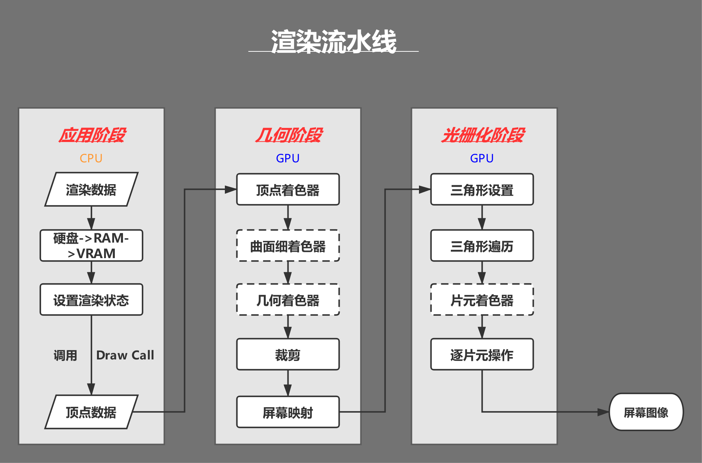
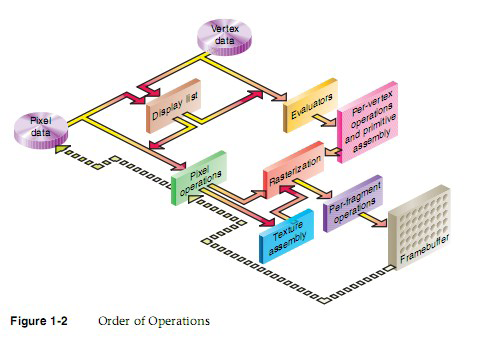
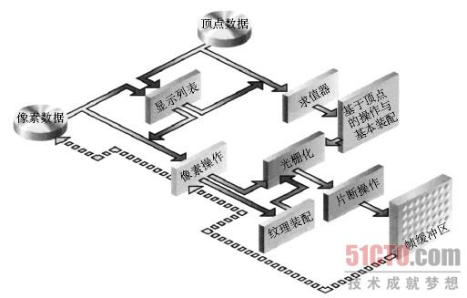

# 语言
### 值类型和引用类型的区别
- 速度上的区别:值类型存取速度快，引用类型存取速度慢。
- 用途上的区别:值类型表示实际数据，引用类型表示指向存储在内存中的数据的指针或引用。
- 来源上的区别:值类型继承自System.ValueType，引用类型继承自System.Object
- 位置上的区别:值类型的数据存储在内存的栈中，引用类型的数据存储在内存的堆中，而内存单元中只存放堆中对象的地址。
- 类型上的区别:值类型的变量直接存放实际的数据，而引用类型的变量存放的则是数据的地址，即对象的引用。
- 保存位置上的区别:值类型变量直接把变量的值保存在堆栈中，引用类型的变量把实际数据的地址保存在堆栈中，而实际数据则保存在堆中。

### 拆箱装箱
- 装箱 就是把“值类型”转换成“引用类型”(Object)
- 拆箱 就是把“引用类型”转换成“值类型”

### in out ref
- in 关键字通过引用传递参数。 它让形参成为实参的别名，这必须是变量。 换而言之，对形参执行的任何操作都是对实参执行的。 它类似于 ref 或 out 关键字，不同之处在于 in 参数无法通过调用的方法进行修改。
- out 关键字通过引用传递参数。 它让形参成为实参的别名，这必须是变量。 换而言之，对形参执行的任何操作都是对实参执行的。 它与 ref 关键字相似，只不过 ref 要求在传递之前初始化变量。 它也类似于 in 关键字，只不过 in 不允许通过调用方法来修改参数值。 若要使用 out 参数，方法定义和调用方法均必须显式使用 out 关键字。
- ref该种类型的参数传递变量地址给方法（引用传递），传递前变量必须初始化。 该类型与out型的区别在与： 1）.ref型传递变量前，变量必须初始化，否则编译器会报错,而out型则不需要初始化 2）.ref型传递变量，数值可以传入方法中，而out型无法将数据传入方法中。换而言之，ref型有进有出，out型只出不进。

### C#字符串复制
- 复制是通过Copy和CopyTo来实现的。string.Copy(要复制的字符串);CopyTo(要复制字符的起始位置(从第几个字符开始往后复制（不包括第几个字符）)，目标字符数组，目标数组中的开始存放位置，要复制的字符个数);


### 介绍const？const修饰成员函数时放在哪？
- 修饰不变常量，在编译的时候就需要有确定的值，只能用于数值和字符串，或者引用类型只能为null，struct也不能用const标记。const可以修饰class的字段或者局部变量，不能修饰属性。而readonly仅仅用于修饰class的字段，不能修饰属性。const是属于类级别而不是实例对象级别，不能跟static一起使用。而readonly既可以是类级别也可以是实例级别，它可以与static一起使用。
- readonly是只读的意思，表示不能进行写操作。最重要的是它在程序运行时才会去求值。它可以是任意类型，当然可以是object，数组，struct，它必须在构造函数或者初始化器中初始化，初始化完成之后不能被修改。通常可以定义一个readonly值为DateTime的常量。而const却无法指定为DateTime类型。
- 只有C#内置类型（int,double,long等）可以声明为const;结果、类和数组不能声明为const。
- readonly 是在字段上使用的修饰符，直接以类名.字段访问。
- const 必须在申明中初始化。之后不能再修改。
- readonly可以在申明中初始化，也可以在构造函数中初始化，其它情况不能修改。

### 函数可以返回引用吗？为什么？
- 引用就是变量的别名，操作一个变量的引用也就相当于操作变量本身，这一点跟指针很类似，但是操作引用不用像操作指针一样，利用取地址符号，很不方便。而操作引用的话，则跟操作普通变量一样，所以C++之中更加鼓励使用引用。
- C语言之中大量利用指针作为形参或者函数返回值，这是由于值拷贝会有很大的消耗（比如传入传出一个大的结构体）。所以在C++之中使用引用作为函数参数和返回值的目的和使用指针是一样的。而且形式上更加直观，所以C++提倡使用引用。
- 使用引用当作函数参数和返回值，效率更高。
- 函数返回的对象引用，必须在调用函数前就已经存在，不允许返回局部变量的引用！
- 当不希望返回的对象被修改的时候，可以添加const。


### C# GC
**基本概念**

- CLR: Common Language Runtime, 公共语言运行时，是一种可以支持多种语言的运行时，其基本的核心功能包含:
    - 内存管理
    - 程序集加载和卸载
    - 类型安全
    - 异常处理
    - 线程同步


- 托管模块的基本组成:
    - PE32/PE32+(64位)
    - CLR头
    - 元数据
    - IL代码(托管代码)
    
- 引用类型和值类型
    - 这部分略过，基本都有相关的认识，本质是看其分配的内存位于内存堆上还是栈上。
    - 每个进程会分配一个对应的进程堆，这就是我们常说的程序内存申请区域，不同进程是不会有交叉的。在堆上还是在栈上进行内存分配，是没有速度差异的，都很快。
    
- 垃圾回收器(Garbage Collector)
    - 在CLR中的自动内存管理，就会使用垃圾回收器来执行内存管理，其会定时执行，或者在申请内存分配是发现内存不足时触发执行，也可以手动触发执行(System.GC.Collect)
    - 垃圾回收的几种基本算法
        - 标记清除算法(Mark-Sweep)关键点是，清除后，并不会执行内存的压缩
        - 复制算法(Copying) 内存等额划分，每次执行垃圾回收后，拷贝不被回收的内存到没有被使用的内存块，自带内存压缩，弊端是内存浪费大(每次只能使用部分，预留部分给拷贝使用)
        - 标记整理算法(Mark-Compact)关键点，清除后，会执行内存压缩，不会有内存碎片
        - 分代收集算法(Generational Collection)对内存对象进行分代标记，避免全量垃圾回收带来的性能消耗。下文会详细讲解。

**垃圾回收模型**

- 垃圾回收的目的
    - 缘由： 内存是有限的，为了避免内存溢出，需要清理无效内存
- 触发时机
    - 申请分配内存时内存不足(本身不足或者内存碎片过多没有足够大小的内存片)
    - 强制调用System.GC.Collect
    - CLR卸载应用程序域(AppDomain)
    - CLR正在关闭(后面2种在进程运行时不会触发)
- 垃圾回收的流程
    - GC准备阶段 暂停进程中的所有线程，避免线程在CLR检测根期间访问堆内存
    - GC的标记阶段 首先，会默认托管堆上所有的对象都是垃圾(可回收对象)，然后开始遍历根对象并构建一个由所有和根对象之间有引用关系的对象构成的对象图，然后GC会挨个遍历根对象和其引用对象，如果根对象没有任何引用对象(null)GC会忽略该根对象。对于含有引用对象的根对象以及其引用对象，GC将其纳入对象图中，如果发现已经处于对象图中，则换一个路径遍历，避免无限循环。PS： 所有的全局和静态对象指针是应用程序的根对象。
    - 垃圾回收阶段 完成遍历操作后，对于没有被纳入对象图中的对象，执行清理操作
    - 碎片整理阶段 如果垃圾回收算法包含这个阶段，则会对剩下的保留的对象进行一次内存整理，重新归类到堆内存中，相应的引用地址也会对应的整理，避免内存碎片的产生。
    


- 分代垃圾回收的过程
    - 分代的基本设计思路:
        - 对象越新，生命周期越短，反之也成立
        - 回收托管堆的一部分，性能和速度由于回收整个托管堆
    - 基本的分代: 0/1/2：
        - 0代: 从未被标记为回收的新分配对象
        - 1代: 上一次垃圾回收中没有被回收的对象
        - 2代: 在一次以上的垃圾回收后任然未被回收的对象
    - 低一代的GC触发，移动到高一代后，未必会触发高一代的GC，只有高一代的内存不足时才会触发高一代的GC
    - 不同代的自动GC频率是可以设置的，一般0:1:2的频率为100：10：1

- 操作图解释分代的过程:


-  非托管对象的回收
    - 对于非托管对象的管理，不受CLR的自动内存管理操作，这部分需要借鉴CLR的自动管理或者手动执行内存回收，这就是两种非托管对象的管理方式: Finalize和Dispose
    - 非托管资源: 原始的操作系统文件句柄，原始的非托管数据库连接，非托管内存或资源

- Finalize
    - System.Object定义了Finalize()虚方法，不能用override重写，其写法类似c++的析构函数:
``` C#
class Finalization{
    ~Finalization()
    {
        //这里的代码会进入Finalize方法
        Console.WriteLine("Enter Finalize()");
    }
}
```

- 转换的IL:

    
    - 基类方法放入到Finally中，其本质还是交给GC进行处理，只是其执行的时间不确定，是在GC完后在某个时间点触发执行Finalize方法，使用这个方法的唯一好处就是: 非托管资源是必然会被释放的。


- IDisposable
    - 继承了该接口，则需要实现Disposable接口，需要手动调用，这就确保了回收的及时性，对应的问题是如果不显示调用Dispose方法，则这部分非托管资源是不会被回收的。
    - c#中的using关键字，转换成IL语句，就是内部实现了IDispoable方法，最终的try/finally中，会在finally中调用dispose方法。

- Unity中的C# GC
    - 目前unity2018.4还是 Boehm–Demers–Weiser garbage collector， unity2019.1 中已经开始引入: Incremental Garbage Collection增量式垃圾回收功能,
    - 相关链接: https://www.gamefromscratch.com/post/2018/11/27/unity-add-incremental-garbage-collection-in-20191.aspx


### Lua GC

**基本数据结构**
lua的基本数据结构: union + type
``` lua
typedef union Value{
    GCObject* gc;   //gc object
    void* p;       // light userdata
    int b;         // booleans
    lua_CFunction f; // light c functions
    lua_Integer i;   //integer number 5.1为double，5.3为long long 8个字节
    lua_Number n;   // double number 5.3 为double 8个字节
} Value;

struct lua_Value{
    Value value_;
    int tt_;
} TValue;
```
对于所有的需要被GC的对象，都会放在GCObject组成的链表中


**GC算法和流程**

1.双色标记清除算法
在Lua5.0中的GC，是一次性不可被打断的操作，执行的算法是Mark-and-sweep算法，在执行GC操作的时候，会设置2种颜色，黑色和白色，然后执行gc的流程，大体的伪代码流程如下:


``` c
每个新创建的对象为白色

//初始化阶段
遍历root链表中的对象，并将其加入到对象链表中    

//标记阶段   
当前对象链表中还有未被扫描的元素:    
    从中取出对象并将其标记为黑色   
    遍历这个对象关联的其他所有对象: 
        标记为黑色
        
//回收阶段
遍历所有对象:   
    如果为白色:   
        这些对象没有被引用，则执行回收
    否则: 
        这些对象仍然被引用，需要保留
```
整个过程是不能被打断的，这是为了避免一种情况：
如果可以被打断，在GC的过程中新创建一个对象
那么如果标记为白色，此时处于回收阶段，那么这个对象没有被扫描就会被回收；
如果标记为黑色，此时处于回收阶段，那么这个对象没有被扫描就会被保留
两种情况都不适合，所以只有让整个过程不可被打断，带来的问题就是造成gc的时候卡顿

**三色标记清除算法**
虽然是三色，本质是四色，颜色分为三种:
- 白色: 当前对象为待访问状态，表示对象还未被gc标记过，也就是对象创建的初始状态； 同理，如果在gc完成后，仍然为白色，则说明当前对象没有被引用，则可以被清除回收
- 灰色: 当前对象为待扫描状态，当前对象已经被扫描过，但是其引用的其他对象没有被扫描
- 黑色: 当前对象已经扫描过，并且其引用的其他对象也被扫描过

其流程伪代码:
``` c
每个新创建的对象为白色

//初始化阶段   
遍历root阶段中引用的对象，从白色设置为灰色，并放入到灰色节点列表中   

//标记阶段    
当灰色链表中还有未被扫描的元素:    
    从中去除一个对象并将其标记为黑色   
    遍历这个对象关联的其他所有对象:   
        如果是白色:
            标记为灰色，并加入灰色链表中   
            
//回收阶段  
遍历所有对象:   
    如果为白色: 
        这些对象没有被引用，需要被回收
    否则:
        重新加入对象链表中等待下次gc   
整个标记过程是可以被打断的，被打断后回来只需要接着执行标记过程即可，回收阶段是不可被打断的。
```
如何解决在标记阶段之后创建的对象为白色的问题?
分裂白色为两种白色，一种为当前白色 currentwhite， 一种为非当前白色 otherwhite，新创建的对象都为otherwhite，则在执行回收的时候，如果为otherwhite则不执行回收操作，等待下次gc的时候，会执行白色的轮换，则新创建的对象会进入下一轮gc。

**lua gc的一些关键点**
1.初始化阶段的操作原理
以前我一直理解这个root就是将gcobject的链表进行转换到灰色链表中，其实并不是，而是去对当前虚拟机中的mainthread表, G表， registry表进行操作，其函数为:
``` c
static void markroot(lua_State * L)
{
    global_State *g = G(L);
    g->gray = NULL;
    g->grayagain = NULL;
    g->weak = NULL;
    //标记几个入口
    markobject(g, g->mainthread);
    markvalue(g, gt(g->mainthread));
    markvalue(g, registry(L));
    markmt(g);
    g->gcstate = GCSpropagte;
}
```
markobject/markvalue都是将对象从白色标记为灰色，所以这里面还有效的数据，就会最终进行扫描标记，如果最终不是白色，则会被保留，而执行回收操作的时候，是对gclist进行操作的，只要是currentwhite，那么就是可以被回收的。

2.对于中途创建的对象的颜色处理
这儿会分为两种，前向操作和后退操作:
- 前向操作: 新创建对象为白色，被一个黑色对象引用，则将当前新创建对象标记为灰色
- 后退操作: 新创建对象为白色，被黑色对象引用，该黑色对象退回到灰色，塞入到grayagain表中，后续一次性扫描处理

对大部分数据，都是前向操作，对于table类型数据，则如果其新创建对象，该table会回退到灰色塞入到grayagain表中。
本质没区别，主要是table属于频繁操作的对象，如果反复将table中新创建的对象都设置成灰色，则灰色链表会容易变得很大，所以为了提高性能，就将table塞入到grayagain表中，后续一次性处理即可。

# UnityEngine
### Unity 协程和线程,进程的区别
- 其实很简单，首先需要理解进程和线程是怎么一回事：进程是Windows系统中的一个基本概念，他包含着运行一个程序所需要的基本资源。一个正在运行的应用程序在操作系统中被视为一个进程，进程可以包括一个或多个线程。　　
- 进程和线程的区别通过以上，一目了然。　　
- 再谈谈线程和协程的区别。一般应用一个应用程序只使用线程这一“资源”。
- 需要明确，Unity只使用了一个线程，但是，我们需要”同时做很多事“，那Unity作为单线程，该如何去做，协程，就来了，协程是一种”伪线程“。
协同程序（coroutine）.,即协作式程序，一系列互相依赖的协程间依次使用CPU，每次只有一个协程工作，而其他协成处于休眠状态。协程实际上是在一个线程中，只不过每个协程对CPU进行分时，协程可以访问和使用unity的所有方法和component。　　　　
- 同一时间只能执行某个协程，协程适合对某个任务进行分时处理。　　　　
- 控制代码在特定的时间执行。　　　　
- 协程不是线程，也不是异步执行，跟Update一样，在主线程中执行。　　　　
- 不用考虑同步和锁的问题。　　　　
- 协程是一个分部组件，遇到条件（yield return）会挂起,直到条件满足才会被唤起执行后面的语句。

### 本地坐标系 世界坐标系
- 世界坐标系：世界坐标是指物体在场景中的坐标，当某个物体没有父物体时，它的position即为世界坐标的position，rotation同理；本地坐标是物体相对于它的父物体的坐标而言，这个相对坐标是以父物体本身为坐标轴进行计算的，与世界坐标没有必然联系。而对于没有父物体的物体，可以认为不存在本地坐标这种说法。
- 本地坐标系：当某个物体有父物体时，它的inspector栏transform中的position实际是localposition，即本地坐标。
- 使用TransformPoint方法将本地坐标系转为世界坐标系

### Unity调整旋转
- 矩阵旋转：
    - 优点：旋转轴可以是任意向量
    - 缺点：旋转其实只需要知道一个向量+一个角度(共4个信息值)，但矩阵却用了16个元素(矩阵法消耗时间和内存)、
- 欧拉角旋转
    - 优点：容易理解，形象直观；表示更方便，只需要三个值(分别对应x、y、z轴的旋转角度)
    - 缺点：欧拉角这种方法是要按照一个固定的坐标轴的顺序旋转的，因此不同的顺序会造成不同结果；欧拉角旋转会造成万向锁现象，这种现象的发生就是由于上述固定的坐标轴旋转顺序造成的。理论上，欧拉角旋转可以靠这种顺序让一个物体旋转到任何一个想要的方向，但如果在旋转中不幸让某些坐标轴重合，就会发生万向锁现象，这时就会丢失一个方向上的旋转能力(两个旋转轴(环)重叠)，也就是说在这种状态下，我们无论怎么旋转(还是按照原先的旋转顺序)，都不可能得到某些想要的结果，除非打破原先的旋转顺序或者同时旋转三个轴。
    - 由于万向锁的存在，欧拉旋转无法实现球面平滑插值。
    - 万向锁的简单解决办法：构造一个不同的旋转层级顺序，但是万向锁总是会在某一个顺序发生，调整旋转顺序不是根本解决办法。（Unity使用的是Z-X-Y顺规，即旋转顺序为z轴、x轴、y轴，虽然某些情况下会出现万向锁，但是这种顺规出现万向锁的概率最小）
    - 万向锁解决办法：将欧拉角转换为四元数，对四元数进行Slerp插值，再将这一系列四元数转换为对应的欧拉角，然后作用于需要进行旋转的对象。这种做法缺点在于消耗内存，但是可以使物体任意旋转，灵活度高。
    - 使用欧拉旋转出现旋转路径偏移的根本原因：在万向锁情况下对欧拉角的插值不是线性的。(突变)
    - 静态欧拉角：其旋转轴使用的是静止不同的参考系。
    - 动态欧拉角：使用object本身的坐标系，因而会随着object旋转而旋转。(局部坐标系会随着对象的旋转而旋转)
- 四元数旋转
    - 优点：可以避免万向锁；只需要一个4维的四元数就可以执行绕任意过原点的向量的旋转，方便快捷，在某些实现下比旋转矩阵效率更高；而且四元数旋转可以提供平滑插值。
    - 缺点：比欧拉旋转稍微复杂了一点，因为多了一个维度，理解更困难，不直观。

### 碰撞器和触发器的区别
- 碰撞器是触发器的载体，而触发器只是碰撞器身上的一个属性。
- 当Is Trigger=false时，碰撞器根据物理引擎引发碰撞，产生碰撞的效果，可以调用OnCollisionEnter/Stay/Exit函数；
- 当Is Trigger=true时，碰撞器被物理引擎所忽略，没有碰撞效果，可以调用OnTriggerEnter/Stay/Exit函数。
- 如果既要检测到物体的接触又不想让碰撞检测影响物体移动或要检测一个物件是否经过空间中的某个区域这时就可以用到触发器

# 图形学
### 渲染管线

- 定义: 显卡内部处理图像信号的并行处理单元,也称为渲染流水线
- 发生位置: CPU和GPU
- 渲染机理: 将图像所具备的图形信息(顶点、纹理、材质、摄像机位置等)经过一系列阶段的处理,最终- 转换为屏幕上的图像.
- 渲染流程:
    - 应用阶段
    - 几何阶段
    - 光栅化阶段
    


- **应用阶段 Application Stage**
- 发生位置: CPU
- 阶段目标: 准备渲染所需的几何信息,即渲染图元(rendering primitives)
- 渲染数据:
    - 场景数据:如摄像机,视锥体,模型,光源..
    - 粗粒度剔除:即剔除不可见物体
    - 渲染状态:材质,纹理,Shader..
- 基本流程：
    - 加载数据到显存: 由于渲染管线的图形化处理基本位于GPU,所以渲染数据先从硬盘加载到RAM,再加载到显存以供GPU后续处理.
    - 设置渲染状态: 定义渲染图形的方式,例如使用顶点着色器或者片元着色器、材质、光源等.
    - 调用Draw Call: 由CPU发起的DrawCall指令给GPU,指向已经准备好的渲染图元
- Draw Call:
    - 本质:图像编程接口
    - 机理:CPU通过调用DrawCall向命令缓冲区(Command Buffer)的队列中添加渲染命令,而GPU则从已有的队列中读取渲染命令去执行
    - 优化:由于调用DrawCall即使得CPU准备大量渲染数据提交到缓冲队列,大量的DrawCall会使得CPU过载,因此尽量减少DrawCall的调用次数(如进行批处理,合并网格...)
- **几何阶段 Geometry Stage**
    - 发生位置: GPU
    - 接收数据: 应用阶段所准备好的渲染图元的信息，也就是顶点数据（模型自身坐标系、顶点颜色、纹理UV等）
    - 阶段目标: 决定所需绘制图元的信息(绘制方法,绘制坐标)
    - 基本流程:
        - 顶点着色器(Vertex Shader): 
            - 调用次数:每个顶点均调用一次
            - 工作:坐标转换(模型空间->齐次裁剪空间，也可说模型自身坐标->屏幕空间坐标。可人为干涉)和逐顶点光照(颜色计算)
        - 曲面细分着色器(Tessellation Shader):
            - 工作:细分图元
        - 几何着色器(Geometry Shader):
            - 工作:逐图元着色操作或是生成新的图元(减少CPU负担)
        - 裁剪(Clipping):
            - 工作:裁剪去不在摄像机视野内的顶点
        - 屏幕映射(Screen Mapping):
            - 工作:将图元的x和y坐标转换到屏幕坐标系(不对z坐标处理)
- **光栅化阶段 Rasterizer Stage**
    - 发生位置: GPU
    - 接收数据: 几何阶段准备好的顶点信息
    - 阶段目标: 对几何阶段传递过来的屏幕空间的顶点信息进行处理,最终生成屏幕像素,渲染出图像
    - 基本流程:
        - 三角形设置(Triangle Setup):
            - 工作:根据几何阶段传递的数据(三角网络的顶点),计算三角网络每边的数据信息
        - 三角形遍历(Triangle Traversal):
            - 工作:根据三角形设置的结果,判断某个三角网格所覆盖的像素,并根据三个顶点的信息对整个覆盖区域进行 插值 ,生成一系列 片元(fragment) ，片元包含信息有:屏幕坐标、深度、法线、纹理...
        - 片元着色器(Fragment Shader): 又称像素着色器(Pixel Shader)
            - 调用次数:一个像素点调用一次
            - 工作:纹理采样,计算光照(阴影、明暗...)
        - 逐片元操作(Per-Fragment Operations):
            - 工作:模板测试->深度测试->混合->颜色缓冲区
        - 输出屏幕图像


### OpenGL渲染管线

绝大数OpenGL实现都有相似的操作顺序，一系列相关的处理阶段称为OpenGL渲染管线。图1-2显示了这些顺序，虽然并没有严格规定OpenGL必须采用这样的实现，但它提供了一个可靠的指南，可以预测OpenGL将以什么样的顺序来执行这些操作。
如果读者刚开始涉足三维图形编程，可能会对接下来的内容感到吃力。读者现在可以跳过这一部分内容，但在读完这本书的每一章时，都应该重温一下图1-2





图1-2显示了Henry Ford在福特汽车公司采用的装配线方法，它也是OpenGL处理数据的方法。几何数据(顶点，直线和多边形)所经历的处理阶段包括求值和基于顶点的操作，而像素数据(像素，图像和位图)的处理过程侧有所不同。在最终的像素数据写入到帧缓冲区之前，这两种类型的数据都将经过相同的最终步骤(光棚化和基于片断的操作)。下面，我们更为详细地介绍OpenGL渲染管线的一些关键阶段。

1. 显示列表Display Lists
任何数据，不管它所描述的是几何图形还是像素，都可以保存在显示列表(display list)中，供当前或以后使用。当然，我们也可以不把数据保存在显示列表中，而是立即对数据进行处理，这种模式也称为立即模式(immediate mode)。当一个显示列表被执行时，被保存的数据就从显示列表中取出，就像在立即模式下直接由应用程序所发送的那样。
2. 求值器Evaluators
所有的几何图元最终都要通过顶点来描述。参数化曲线和表面最初可能是通过控制点以及成为基函数(Basic function)的多项式函数进行描述的。求职器提供了一种方法。根据控制点计算表示表面的顶点。这种方法是一种多项式映射，它可以根据控制点产生表面法线、纹理坐标、颜色以及空间坐标。
3. 基于顶点的操作Per-Vertex Operations
对于顶点数据，接下来的一个步骤就是"基于顶点的操作"，就是把顶点变换为图元。有些类型的顶点数据(例如空间坐标)是通过一个4x4 的浮点矩阵进行变换的。空间坐标从3D世界的一个位置投影到屏幕上的一个位置。如果启用了高级特性，这个阶段将更为忙碌。如果使用了纹理，这个阶段还将生成并变换纹理坐标。如果启用了光照，就需要综合变换后的顶点，表面法线，光源位置，材料属性以及其他光照信息进行光照计算，产生最终的颜色值。
4. 图元装配Primitive Assembly
图元装配的一个主要内容就是剪裁，它的任务是消除位于半空间(half-space)之外的那部分几何图元，而这个半空间是由一个平面所定义的。点剪裁就是简单地接受或拒绝顶点，直线或多边形剪裁则可能需要添加额外的顶点，具体取决于直线或多边形是如何进行剪裁的。在有些情况下，接下来需要执行一个称为透视除法(perspective division)的步骤。它使远处的物体看起来比近处的物体更小一些。接下来所进行的是视口(viewport)和深度(z 坐标)操作。如果启用了剔除功能(culling)并且该图元是个多边形，那么它就有可能被剔除测试所拒绝。取决于多边形模式，多边形可能被画成点的形式或者直线的形式。这个阶段所产生的结果就是完整的几何图元，也就是根据相关的颜色，深度(有时还有纹理坐标值以及和光棚化处理有关的一些指导信息)进行了变换和剪裁的顶点。
5. 像素操作Pixel Operations
在 OpenGL 的渲染管线中，和单路径的几何数据相比，像素数据所经历的流程有所不同。首先，来自系统内存的一个数组中的像素进行解包，从某种格式(像素的原始格式可能有多种)解包为适当数量的数据成分。接着，这些数据被缩放、偏移，并根据一副像素图进行处理。处理结果先进行截取，然后或者写入到纹理内存，或者发送到光棚化阶段。如果像素数据时从帧缓冲区读取的，就对他们执行像素转换操作(缩放、偏移、映射和截取)。然后，这些结果被包装为一种适当的格式，并返回到系统内存的一个数组中。OpenGL 有一种特殊的像素复制操作，可以把数据从帧缓冲区复制到帧缓冲区的其他位置或纹理内存中。这样，在数据写入到纹理内存或者写回到帧缓冲区之前，只需要进行一道像素转换就可以了。
6. 纹理装配Texture Assembly
OpenGL 应用程序可以在几何物体上应用纹理图像，使它们看上去更为逼真。如果需要使用多幅纹理图像，把它们放在纹理对象中是一种明智的做法。这样，就可以很方便地在他们之间进行切换。有些 OpenGL 实现拥有一些特殊的资源，可以加速纹理的处理。这种资源可能是专用的，高性能的纹理内存。如果确实拥有这种内存，纹理对象可能会优先进行处理，以控制这种有限和宝贵的资源的使用。
7. 光棚化Rasterization
光棚化就是把几何数据和像素数据转换为片断(fragment)的过程。每个片断方块对应用于帧缓冲区中的一个像素。把顶点连接起来形成直线或者计算填充多边形的内部像素时，需要考虑直线和多边形的点画模式，直线的宽度，点的大小，着色模型以及用于支持抗锯齿处理的覆盖计算。每个片断方块都将具有各自的颜色和深度值。
8. 片断操作Fragment Operations
在数据实际存储到帧缓冲区之前， 将要执行一系列的操作。这些操作可能会修改甚至丢弃这些片断。所有这些操作都可以被启用或禁用。第一个可能执行的操作时纹理处理。在纹理内存中为每个片断生成一个纹理单元(texel，也就是纹理元素)，并应用到这个片断上。接着可能进行的是雾计算，然后是剪裁测试，alpha测试，模板测试和深度缓冲区测试(深度缓冲区用于消除被隐藏的表面)。如果一个片断无法通过一个启用的测试，它的连续处理过程可能会被中断。随后，将要执行的可能是混合，抖动，逻辑操作以及根据一个位掩码的屏蔽操作。最后，经过完整处理的片断就被绘制到适当的缓冲区，最终成为一个像素并到达它的最终栖息地。


### 光照模型
这里图片和知识点太多，就直接贴源地址了
1. [Unity Shader-学习-3.光照模型](https://www.jianshu.com/p/53c6710db1c5)
2. [Unity Shader-标准光照模型总结](https://blog.csdn.net/u010832643/article/details/90580897)
3. [Unity Shader-兰伯特光照模型与Diffuse Shader](https://blog.csdn.net/puppet_master/article/details/53074789)
4. [Unity Shader-Phong光照模型与Specularr](https://blog.csdn.net/puppet_master/article/details/53428885)

### 延迟渲染
我们知道，正向渲染(Forward Rendering)，或称正向着色(Forward Shading)，是渲染物体的一种
非常直接的方式，在场景中我们根据所有光源照亮一个物体，之后再渲染下一个物体，以此
类推。
传统的正向渲染思路是，先进行着色，再进行深度测试。 其的主要缺点就是光照计算跟场景
复杂度和光源个数有很大关系。假设有 n 个物体， m 个光源，且每个每个物体受所有光源的
影响，那么复杂度就是 O(m*n)。

正向渲染简单直接，也很容易实现，但是同时它对程序性能的影响也很大，因为对每一个需
要渲染的物体，程序都要对每个光源下每一个需要渲染的片段进行迭代，如果旧的片段完全
被一些新的片段覆盖，最终无需显示出来，那么其着色计算花费的时间就完全浪费掉了。

可以将延迟渲染( Deferred Rendering)理解为先将所有物体都先绘制到屏幕空间的缓冲（即 Gbuffer， Geometric Buffer，几何缓冲区）中，再逐光源对该缓冲进行着色的过程，从而避免了
因计算被深度测试丢弃的⽚元的着色而产⽣的不必要的开销。 也就是说 延迟渲染基本思想
是，先执行深度测试，再进行着色计算，将本来在物空 间（三维空间）进行光照计算放到了
像空间（二维空间）进行处理。
对应于正向渲染 O(m*n)的 复杂度，经典的延迟渲染复杂度为 O(n+m)。


### 判断矩阵相交
首先求出P1与P3点在X方向较大值与Y方向较大值的交点，在下图中就是P3，用红点(记为M点)表示。然后求出P2与P4点在X方向较小值与Y方向较小值的交点，在下图中就是P2，用橙色点(记为N点)表示。如果M点的X坐标和Y坐标值均比N点相应的X坐标和Y坐标值小，亦即M和N可以分别构成一个矩形的左上角点和右上角点，则两矩形相交；其余情况则不相交。


``` C++
class Solution {
public:
    int computeArea(int A, int B, int C, int D, int E, int F, int G, int H) {
        int s1 = (C - A) * (D - B), s2 = (G - E) * (H - F);
        int mix = max(A, E), miy = max(B, F), maxx = min(C, G), maxy = min(D, H);
        if(mix <= maxx && miy <= maxy){
        int s3 = (maxx - mix) * (maxy - miy);
        return s1 + s2 - s3;
        }
        else return s1 + s2;
    }
};
```

# 设计模式
### 七大设计模式
- 单一职责原则
    - 这个原则强调的是“当设计封装一个类时，该类应该只负责一件事”
    说起来好像很简单，实际上对功能的划分通常也是开发者最头疼的一件事。
    解决方案就是对类进行不断的重构，将部分功能抽成新的类，再利用组合的方式将新的类加
    到原来的类中，慢慢的就会变成一个类只负责单一功能的实现。    
- 开闭原则
    - 这个原则强调的是“一个类应该对扩展开放，对修改关闭”
    具体来说，对于已经完成测试或者上线运营的功能，我们不应该再修改这个类的任何接口或者实现内容，但是应该对功能的增加保持开放。
    为了满足这个原则的要求，我们需要将“方法”上升到接口，将“实现”下放到子类中，这样当新增一个需求时，我们重新实现一个子类继承自接口或者旧的子类，然后在新的子类中新增功能，这样就保证了旧的功能没有发生变化（对修改关闭），同时新增了功能（对扩展开放）。
- 里氏替换原则
    - 这里强调的是“子类必须能够替换父类”
    关于这个概念，一般书中介绍的都比较抽象，也曾将困扰了许多人。笔者在此结合多方资料，说一下自己的理解
    首先里氏替换原则是继承复用的基础，反映了父类与子类之间的关系。
    通俗的讲有父类的地方，全部替换成子类，不影响程序的运行，这样就满足里氏替换原则。
    那什么样的子类在替换父类时，不会影响程序运行呢？
    这种子类可以扩展父类的功能，但不能修改父类的原有功能。这也是对单一职责原则的补充——对扩展开放，对修改关闭。
    如果违背了里氏替换原则，会让程序出错的概率大大提升
    举个栗子🌰🌰🌰
    我们定义了一个父类——鸟，并且带有一个方法可以返回鸟的飞行高度。再定义两个子类：麻雀、企鹅，并且企鹅重写了返回飞行高度的方法，使得返回值为0。当外部需要获取所有鸟类的飞行高度，并作为除数的分母使用，我们都知道0不可以作为分母，这时程序便出错了。
    这个栗子便出现了“子类修改父类原有功能”的禁忌，违反了里氏替换原则，也就是不能采用继承结构，要重新设计他们之间的关系。
- 依赖倒置原则
    - 这个原则包含了两个主题
    高层模块不能依赖于底层模块，两者都应该依赖于抽象概念
    抽象接口不应该依赖于实现，而实现应该依赖于抽象接口
    这里的抽象概念，我理解为接口，所以这是在告诉我们，要面向接口编程，不要面向实现方式编程。
    那为什么我们要面向接口编程呢，这里我举一个实际生活中的栗子🌰🌰🌰
    我们的电脑就是高层模块，各种硬件设备就是底层模块，我们每增加一个硬件设备（底层模块），电脑（高层模块）就需要设计一个新的接口来兼容设备，这样便是高层模块依赖于底层模块，并且这并没有满足开闭原则，因为每次新增设备，都要对电脑进行修改。但是如果电脑定义了一个通用接口，每个硬件设备都遵循了接口协议，大家都可以插到同一个接口上，那电脑便不再依赖硬件设备了，并且两者现在都只需要跟中间层接口沟通就好，这也就是两者都依赖于抽象概念。
    所以从这里我们能看出，依赖导致原则也是实现开闭原则的重要途径之一，他的目的是通过面向接口编程，来降低类与类之间的耦合。
- 接口隔离原则
    - 这里强调的是“客户端不应该被迫使用他们用不到的接口方法”
    其实就是要求我们对各个类，建立他们专用的接口，而不要试图去建立一个庞大的接口提供给所有需要他的类去调用它。
- 最少知识原则
    - 定义上说，一个类应该对其他类拥有最少的知识
    翻译成人话就是，如果两个类之间无需直接通信，那就不要互相调用，交给第三方转发就好了
    举个栗子🌰🌰🌰
    公司老板不需要跟公司每个员工都直接交流，他只需要跟项目经理交流就好，由项目经理负责传达老板的指示，这样老板就拥有了对其他员工最少的知识，解除了对每个员工的依赖（耦合），现在他只依赖于项目经理。至于基层人员，当然可以说开就开喽。
    但是在使用迪米特法则的时候需要反复权衡，如果使用不当，会产生大量中介类，使项目结构变的混乱。
- 合成复用原则
    - 其实合成复用原则讲的就是如果可以用组合解决问题，就不用继承。
    也就是组合优于继承。
    为什么组合会优于继承呢？
    首先，如果使用了继承，子类重写了父类方法，就会违背里氏替换原则，会让程序增加出错的可能。这里合成复用原则和里氏替换原则又是相辅相成的。
    其次，使用继承，子类会依赖于父类的实现，这不利于类的扩展和实现。
    最后，C#是无法使用多重继承的，使用组合的方式会比层层继承来的明白，利于项目的维护。
    实现这个原则的方式也很简单，是通过将已有的对象纳入新对象中，作为新对象的成员对象来实现的，新对象可以调用已有对象的功能，从而达到复用。
- 总结
    - 设计模式就是学习面向对象程序设计的最佳模版，它在我看来最终的目的都是通过解耦来提升程序的稳定性和扩展性，使用的手段包括提供中间层（接口）、划分职责、约定限制等。
    而我们在游戏开发中，面临最多的问题在前期可能是大量的需求更改，中期要求敏捷开发，后期需要提供稳定的游戏框架支撑千万级用户，这都需要用到设计模式。
    此篇是对设计模式笔记的一个开头，后面会总结常见的设计模式与游戏开发结合的案例，并且会提供Unity版本的实现方式。

### 工厂模式
##### 简单工厂模式
讲工厂，首先得从简单工厂说起。
简单工厂模式的目的是用来创建不同类型的对象。需要指出的是它并不是GOF的23种模式之一。

**结构:**


**实现:**
``` C#
public interface IProduct {
    void DoSth();
}

public class ProductFirst : IProduct {
    public virtual void DoSth(){
        Debug.Log("ProductFirst DoSth");
    }
}
public class ProductSecond : IProduct {
    public virtual void DoSth(){
        Debug.Log("ProductFirst DoSth");
    }
}

public class SimpleFactory {
    public static IProduct Create(int id){
        switch(id){
            case 1:
                return new ProductFirst();
                break;
            case 2:
                return new ProductSecond();
                break;
            default:
                return null;
                break;
        }
    }
}
```
简单工厂模式的Create()方法里，可以添加各种逻辑，用于创建对应的实例。unity3d中很多时候创建的是游戏中的物件，这时简单工厂模式中创建者的参数可以对应prefab的名字。

**优点**
简单，可以取名叫『2分钟内可以学会的设计模式』
实现逻辑清晰，根据不同的创建参数创建对应实例。
名为简单工厂方法，看起来果然是很简单，对不对？那么，本着”simple is best”的逻辑，是不是我们应该大力推广简单工厂模式呢？
答案是「No」。简单工厂模式有其固有的缺陷，在使用时需要严格限定其范围。

**缺陷**
让我们首先考虑一个问题。此处使用的Create()方法，直接决定我们产生实例的逻辑。
那么，现在问题来了。
假如我们不希望通过判断参数是1还是2，来进行不同实例的生成呢？
显然，一旦我们需要新的逻辑来产生实例的话，我们就不得不对代码进行修改。
当然，从理论上，我们也可以发现简单工厂模式的一些问题。
Open-closed原则，即是对扩展开放，对修改封闭。使用简单工厂模式时，很多时候违背了这一原则。同时，由于产生不同实例的方法在可预见的将来有可能会变得很复杂，是否满足单一职责这一点也值得商榷。
那么，我们有办法解决这个问题吗？嗯，接下来就是抽象程度更高的方法出场了。


##### 工厂方法

工厂方法与简单工厂最大的区别，在于工厂方法将工厂进行了抽象，将实现逻辑延迟到工厂的子类。

**结构**


**实现**
为了让我们例子更贴近生产环境，在这里采用一个更加实际的问题。
场景当中有两个物体，我们希望其中一个向左走，一个向右走。
我们用工厂方法来生成这两个向左向右的控制器，并添加到对应的物体上。当然，事实上这个例子依然很单薄，实际面对这个问题我们肯定不会这样实现就是了。
上代码

 IWalker
``` C#
public interface IWalker {
    void Walk(Transform target);
}
```
LeftWalker
``` C#
public class LeftWalker : MonoBehaviour, IWalker {
    Transform _target;
    public virtual void Walk(Transform target){
        _target = target;
        StartCoroutine(WalkLeft());
    }

    IEnumerator WalkLeft(){
        while(true){
            _target.Translate(Vector3.left * Time.deltaTime);
            Debug.Log("WalkLeft " + _target.localPosition);
            yield return new WaitForFixedUpdate();
        }
    }
}
```

RightWalker
``` C#
public class RightWalker : MonoBehaviour, IWalker  {
    Transform _target;
    public virtual void Walk(Transform target){
        _target = target;
        StartCoroutine(WalkRight());
    }

    IEnumerator WalkRight(){
        while(true){
            _target.Translate(Vector3.right * Time.deltaTime);
            Debug.Log("WalkRight " + _target.localPosition);
            yield return new WaitForFixedUpdate();
        }
    }
}
```

IWalkerFactory
``` C#
public interface IWalkerFactory {
    IWalker Create();
}
```

LeftWalkerFactory
``` C#
public class LeftWalkerFactory : IWalkerFactory {
    public virtual IWalker Create(){
        return new GameObject().AddComponent<LeftWalker>();
    }
}
```

RightWalkerFactory
``` C#
public class RightWalkerFactory : IWalkerFactory{
    public virtual IWalker Create(){
        return new GameObject().AddComponent<RightWalker>();
    }
}
```

**优点**
工厂方法比简单工厂多了一层抽象。
由于抽象工厂层的存在，当我们需要修改一个实现的时候，我们不需要修改工厂的角色，只需要修改实现的子类就可以完成这个工作。
同样，当我们需要增加一个新产品的时候，我们也不需要修改工厂的角色，只需要增加一个新的实现工厂来完成实现就可以了。
显然，这样更易于扩展，并且，整体代码的层级结构更加分明，创建实际产品的职责更加单一。
此外，很显然客户在定义工厂角色的时候不需要知道实现子类。只有当实际需要创建的时候，才动态指定子类。这同样带来了代码的稳定性和最小可知性。

**缺陷**
显然，使用工厂方法的代码量是多于简单工厂的。
同时，每增加一个新的产品，就会增加一个新的工厂类，代码的复杂程度自然也随之上升了。我们会为此创建很多的工厂。

##### 抽象工厂
抽象工厂和工厂方法实际上是很像的，不过抽象工厂增加了另外一个概念，就是产品族。也就是说，一个工厂可以生产一系列的产品，这些产品的定义都在工厂当中。

**结构**


**实现**
ok。这个模式老实说意义不是很大。直接上代码吧，就不加注释了
``` C#
public interface IActorFactory  {
    IFlyer CreateFlyer(GameObject go);
    IWalker CreateWalker(GameObject go);
}
 
public interface IFlyer {
    void Fly(Transform target);
}
 
public class LeftActorFactory : IActorFactory {
    public virtual IFlyer CreateFlyer(GameObject go){
        return go.AddComponent<LeftFlyer>();
    }
 
    public virtual IWalker CreateWalker(GameObject go){
        return go.AddComponent<LeftWalker>();
    }
 
}
 
public class RightActorFactory : IActorFactory{
    public virtual IFlyer CreateFlyer(GameObject go){
        return go.AddComponent<RightFlyer>();
    }
 
    public virtual IWalker CreateWalker(GameObject go){
        return go.AddComponent<RightWalker>();
    }
 
}
```
**优点**
当我们需要增加一个产品族的时候，我们只需要增加一个工厂，实现其中所有产品的实现就行了。 
抽象工厂的设计，使得我们可以很容易的增加一个产品系列。

**缺点**
抽象工厂当中，产品族的定义使得子类必须去实现所有的产品生产。 
因此，抽象工厂并不适合于横向扩展，即需要增加产品的情况。 
一旦需要增加产品，那么我们甚至需要去修改抽象的基类。这是比较违反开闭原则，不太符合面向对象设计的做法。

**总结**
从简单工厂到工厂方法再到抽象工厂。我们可以看到，抽象的程度越来越高，能够解决的问题也越来越复杂。 
不过，个人的经验而言，一般在unity3d当中也顶多用到工厂方法而已。抽象工厂事实上并不是一个很灵活的解决方案。 
而且，对于unity3d中组件的创建，事实上是有一些非常灵活的解决方案可以处理的。实体与组件系统，相当适合于组件的构建，比起工厂方法来说更加灵活和易于扩展。 
以后有时间的时候再对此进行说明。


# 网络
### TCP UDP
- TCP(Transmission Control Protocol 传输控制协议)：是一种面向连接的、可靠的、基于字节流的传输层通信协议，使用三次握手协议建立连接、四次挥手断开连接。面向连接意味着两个使用TCP的应用(通常是一个客户端和一个服务器)在彼此交换数据包之前必须先建立一个TCP连接。在一个TCP连接中，仅有两方进行彼此通信，广播和多播不能用TCP。TCP 协议的作用是，保证数据通信的完整性和可靠性，防止丢包。TCP把连接作为最基本的对象，每一条TCP连接都有两个端点，这种端点我们叫作套接字(socket)，端口号拼接到IP地址即构成了套接字。
- UDP(User Datagram Protocol 用户数据报协议)：是OSI(Open System Interconnection 开放式系统互联)参考模型中一种无连接的传输层协议，提供面向事务的简单不可靠信息传送服务。UDP协议的主要作用是将网络数据流量压缩成数据包的形式。
- 区别：
    - TCP提供的是面向连接的、可靠的数据流传输；UDP提供的是非面向连接的、不可靠的数据流传输。
    - TCP提供可靠的服务，通过TCP连接传送的数据，无差错、不丢失、不重复，按序到达；UDP尽最大努力交付，即不保证可靠交付。
    - TCP面向字节流；UDP面向报文。
    - TCP连接只能是点到点的；UDP支持一对一、一对多、多对一和多对多的交互通信。
    - UDP具有较好的实时性，工作效率比TCP高，适用于对高速传输和实时性有较高的通信或广播通信。
    - TCP对系统资源要求较多，UDP对系统资源要求较少。TCP首部有20字节；UDP的首部只有8个字节。
    - TCP的逻辑通信信道是全双工的可靠信道；UDP的逻辑通信信道是不可靠信道。 
    - 基于TCP的应用：HTTP、WebSocker、重要数据文件传输等常见
    - 基于UDP的应用：QQ等部分实时通信软件、视频/音频下载传输等。

### 三次握手，4次挥手
- 三次握手
    - 第一次握手：客户端发送网络包，服务端收到了。这样服务端就能得出结论：客户端的发送能力、服务端的接收能力是正常的。：客户端给服务端发一个 SYN 报文，并指明客户端的初始化序列号 ISN(c)。此时客户端处于 SYN_Send状态。
    - 第二次握手：服务端发包，客户端收到了。这样客户端就能得出结论：服务端的接收、发送能力，客户端的接收、发送能力是正常的。不过此时服务器并不能确认客户端的接收能力是否正常。：服务器收到客户端的 SYN 报文之后，会以自己的 SYN 报文作为应答，并且也是指定了自己的初始化序列号 ISN(s)，同时会把客户端的 ISN + 1 作为 ACK 的值，表示自己已经收到了客户端的 SYN，此时服务器处于 SYN_REVD的状态。
    - 第三次握手：客户端发包，服务端收到了。这样服务端就能得出结论：客户端的接收、发送能力正常，服务器自己的发送、接收能力也正常。：客户端收到 SYN 报文之后，会发送一个 ACK 报文，当然，也是一样把服务器的 ISN + 1 作为 ACK 的值，表示已经收到了服务端的 SYN 报文，此时客户端处于 establised状态。
    - 服务器收到 ACK 报文之后，也处于 establised 状态，此时，双方以建立起了链接。
- 四次挥手
    - 第一次挥手：客户端发送一个 FIN 报文，报文中会指定一个序列号。此时客户端处于CLOSED_WAIT1状态。
    - 第二次握手：服务端收到 FIN 之后，会发送 ACK 报文，且把客户端的序列号值 + 1 作为 ACK 报文的序列号值，表明已经收到客户端的报文了，此时服务端处于 CLOSE_WAIT2状态。
    - 第三次挥手：如果服务端也想断开连接了，和客户端的第一次挥手一样，发给 FIN 报文，且指定一个序列号。此时服务端处于 LAST_ACK的状态。
    - 第四次挥手：客户端收到 FIN 之后，一样发送一个 ACK 报文作为应答，且把服务端的序列号值 + 1 作为自己 ACK 报文的序列号值，此时客户端处于 TIME_WAIT状态。需要过一阵子以确保服务端收到自己的 ACK 报文之后才会进入 CLOSED 状态
    - 服务端收到 ACK 报文之后，就处于关闭连接了，处于 CLOSED 状态。